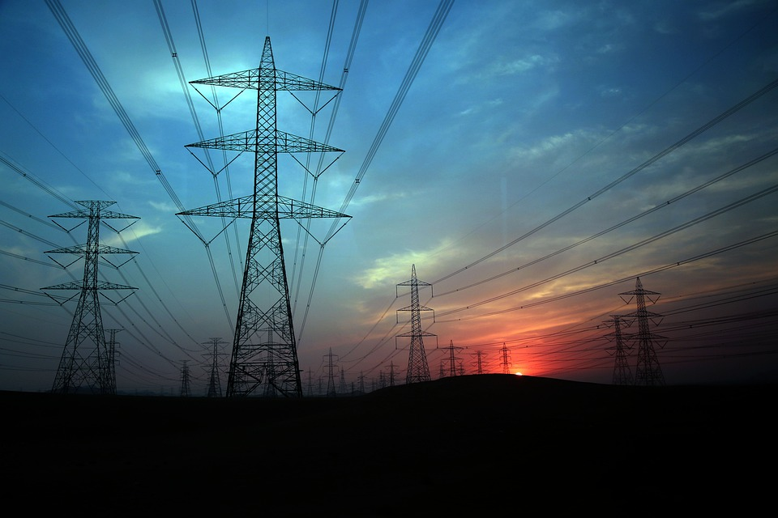

# Spain Electricity Shortfall Prediction Challenge

## Overview

The availability of electricity significantly impacts the well-being of a nation's residents. Electricity serves various crucial purposes, such as enabling communication, providing warmth, and ensuring our ability to nourish our families. Consequently, it is imperative to ensure a reliable power supply to enhance and sustain our quality of life through investments in electrical infrastructure. Nevertheless, recent evidence has shown that relying solely on non-renewable energy sources is not environmentally sustainable.

 

 

The government of Spain is determined to improve the standard of living of its citizens by ensuring a steady supply of electricity and is therefore considering an expansion of its renewable energy resource infrastructure investments as a key to achieving that. As such, they require information on the trends and patterns of the country's renewable sources and fossil fuel energy generation. For this very reason, the government of Spain has been tracking the different energy sources available within the country.

## Objectives

 - In this project, we were tasked with building a model for the government of Spain to predict the shortfall between energy generated by fossil fuels and energy generated with renewable sources. The daily shortfall, which was referred to as the target variable, was modelled as a function of various city-specific weather features such as `pressure`, `wind speed`, `humidity`, etc.

 - Using different test parameters, we assessed the different models to ascertain which has better accuracy and then deployed this model on a remote server (Amazon EC2 Instance) to make it accessible to the client.

### Important Concepts

The **shortfall between the energy generated by means of fossil fuels and various renewable sources** refers to the difference in the amount of energy produced by using fossil fuels (such as coal, natural gas, and oil) compared to the energy generated from various renewable sources (such as solar, wind, hydroelectric, geothermal, and biomass). This concept is often used in discussions relating to the transition from fossil fuels to renewable energy sources and the efforts to reduce reliance on fossil fuels for electricity generation.

The **shortfall** occurs when the total energy generated from **renewable** sources is less than the energy generated from **fossil fuels**. This shortfall can be due to various factors such as Intermittency, Capacity, Energy Storage,Infrastructure and Investment, and Geographical Constraints

Energy Demand Shortfall Prediction using advanced regression techniques refers to the application of sophisticated regression models to forecast or predict instances when there will be a shortfall in energy. This type of predictive analysis is essential for energy utilities, grid operators, and policymakers to effectively manage and plan for energy supply and demand, ensuring a stable and reliable energy grid.

## Data

The dataset contains information about the weather conditions in various Spanish cities for the time of 2015-2017. The dataset also has information about the three hourly load shortfalls for the same period. In the context of this problem, the three hourly load shortfall is the difference between the energy generated by means of fossil fuels and renewable sources.

The dataset contains 47 features and 1 target. The features include the time and the city-specific weather variables i.e. the wind speed in the city of Barcelona. In total there is weather data available for 5 cities but not all cities have weather information available for every weather category e.g. we might have wind speed data for Barcelona but not rainfall data whereas we have both rainfall and wind speed information for Valencia.

**Weather data for the following cities of Spain was given:**

 - Madrid
 - Valencia
 - Seville
 - Bilbao
 - Barcelona

**The weather categories in the dataset include:**
 - wind_speed
 - wind_degree
 - rain_1h
 - rain_3h
 - humidity
 - clouds_all
 - pressure
 - snow_3h
 - weather_id
 - temp_max
 - temp

## Feature Engineering and Model Training

 - Split the train dataset by city to have a view of the impact of city-specific features.
 - Evaluated the correlation of the different features with the output variable.
 - Checked for multicollinearity among the features.

A train-test-split of 34% was used as it gave the best performance for the data. Linear regression, LASSO regression and Random forest regression were the three regression models that were trained on the data and the performance of all three models were assessed using RMSE and R2_score.

The predicted three-hourly load shortfall had the following summary statistics:
 - Mean load shortfall of 10,545kWh
 - A maximum load shortfall of 20,492kWh
 - A negative minimum load shortfall of 257kWh
 - The Median load shortfall is 10,891kWh

## Model Evaluation

The evaluation metric for the Kaggle competition was Root Mean Square Error (RMSE) is commonly used in regression analysis and forecasting. It measures the standard deviation of the residuals arising between predicted and actual observed values for a modeling process.

After comparison of the different models, random forest was selected as it gave the best performance among the tested models using the RMSE.

## Kaggle Submission

The random forest model was used to make a submission on Kaggle for the [Spain Electricity Shortfall challenge](https://www.kaggle.com/competitions/spain-electricity-shortfall-challenge-2022/leaderboard) where my team was able to attain an 8th position on the leaderboard after a lot of fine-tuning of the model.

## Model Deployment

We build an API using the Flask web server framework and then hosted the API within an Amazon EC2 Instance making the model readily available to be consumed.

## References

Chris Barnett, ExploreAI Academy, Zintle Faltein. (2022). Spain Electricity Shortfall Challenge 2022. Kaggle. https://kaggle.com/competitions/spain-electricity-shortfall-challenge-2022